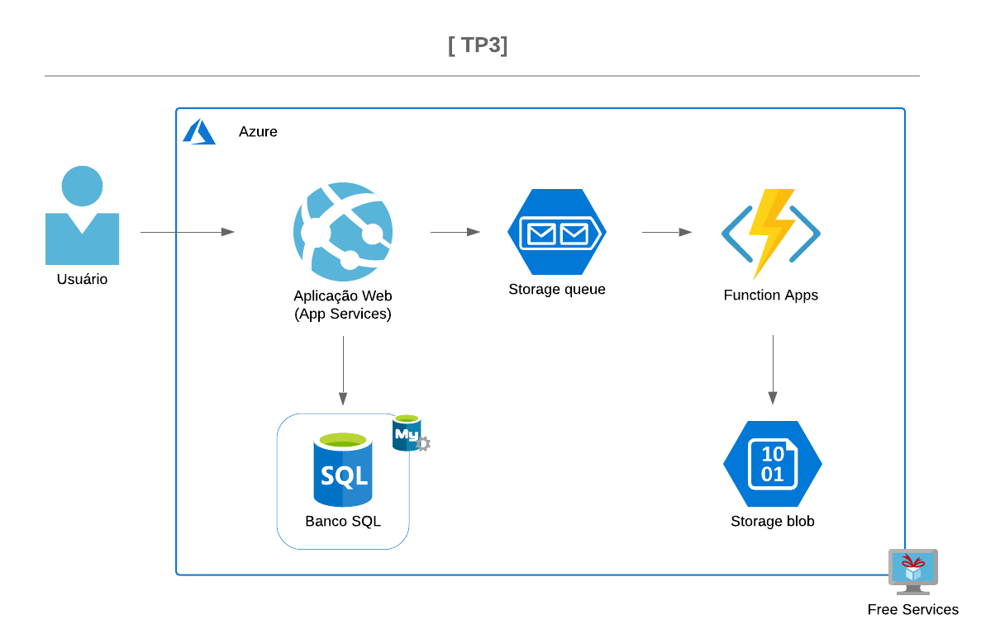

### Desenvolvimento com serviços WCF e Microsoft Azure
### [TP3 publicado no Azure]()

* https://allmusix.azurewebsites.net/


```bash
TESTE DE PERFORMANCE - TP3 [OBRIGATÓRIO]

Nas etapas 5 e 6 da disciplina de Desenvolvimento com Microsoft Azure, você compreendeu o que é o serviço de 
armazenamento em Fila do Azure, e como trabalhar com processos assíncronos e desacoplados. 
Você também aprendeu a usar o serviço de funções sem servidor (serverless) com custo baixíssimo para realizar 
pequenos procedimentos na nuvem da Microsoft.

Nesse TP03, você deve criar um projeto do tipo ASP.NET Core Web MVC. Nesse projeto você deve 
desenvolver um CRUD básico (listagem, detalhe, inclusão, alteração, exclusão) 
cuja entidade tenha pelo menos cinco atributos diferentes (incluindo o endereço web de uma imagem), 
dos quais pelo menos três dos atributos devem possuir tipos diferentes. 
As operações do CRUD devem persistir os dados da entidade em um banco de dados SQL do Azure.

Na operação de inclusão, a aplicação deve ser capaz de enviar uma mensagem para uma 
fila (dentro da mensagem deve conter o endereço web da imagem). 
Esta fila deve ser consumida por uma function, o qual deve ser capaz de armazenar uma imagem como Blob no Azure. 
A página de detalhe deve ser capaz de exibir a imagem.

Adicionalmente, a aplicação desenvolvida deve conter projetos e classes de acordo com os princípios do Domain Driven Design (DDD) estudados em aula

```
## [Screenshots]()

